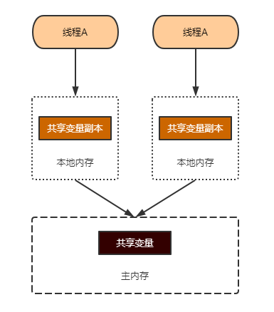
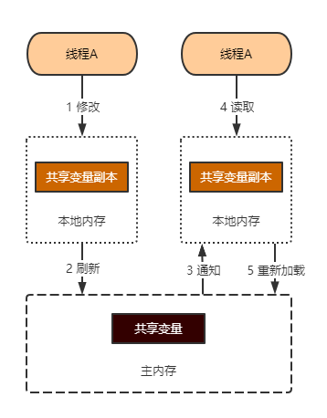

## 问题描述

谈一谈你对JMM的理解？

难度指数：★★★

遇到概率：★★

## 问题回答

JMM指的是Java Memory Model，翻译过来叫Java内存模型。JMM是在JSR-133提出的一个抽象规范。规范多个线程之间是如何进行通信的。

当我们使用多线程的时候，多个线程可能会使用和修改同一个变量。这些变量一般在堆或者方法区里面，是所有线程共享的，我们称它们为“共享变量”。

JMM定义了主内存和线程本地内存的概念。所有共享变量，都放在主内存中。每个线程都有一个本地内存，在本地内存里面保存了共享变量的副本。

为什么要这样设计呢？因为现代计算机为了高效，往往会在高速缓存区中缓存共享变量，因为CPU访问缓存区比访问内存要快得多。

线程间的通信必须经过主内存。也就是说，线程A和线程B想要通信，必须经过以下步骤：

1. 线程A改变本地内存中的共享变量副本，然后刷新到主内存去
2. JMM通知线程B，这个变量发生了更新，他下一次使用这个变量之前，需要去主内存重新加载副本。

我们管这种现象叫“内存可见性”，JMM使用happens-before的概念来定制两个操作之间的执行顺序。然后，告诉程序员们：只要你的程序遵循happens-before规则，我就可以给你保证内存可见性。